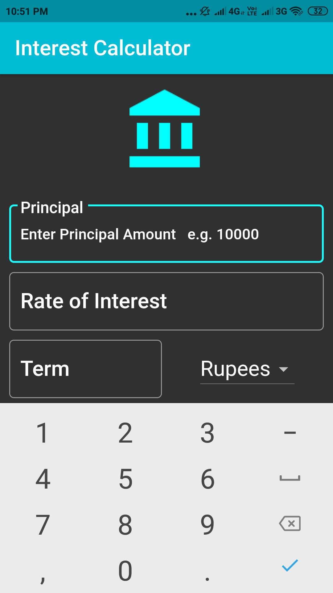
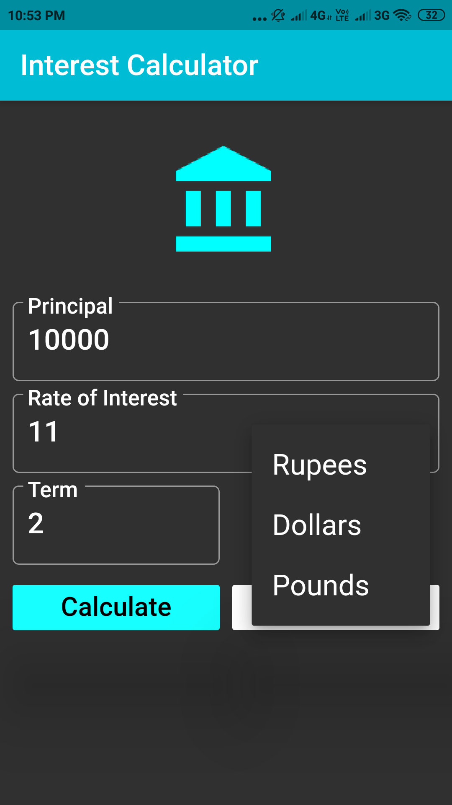
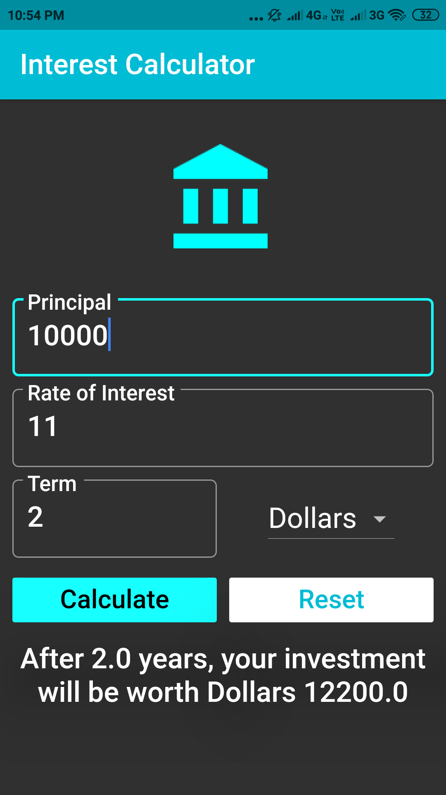
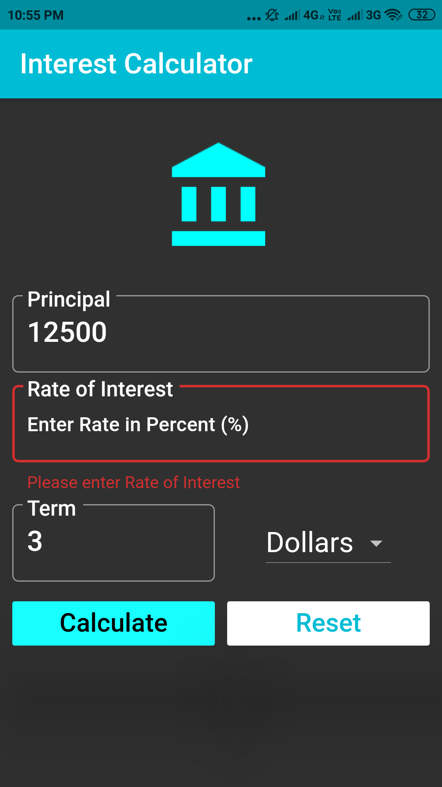

# SI_Calculator

A Simple Interest Calculator using Flutter framework that takes Principal amount, Rate of Interest, Term and Currency as the Input and displays the Total Amount.

Android Screenshots of Simple Interest Calculator Application

      
